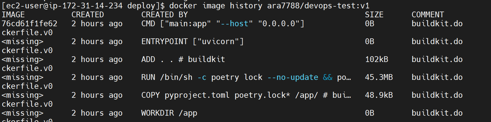

Fork this repo, so you can make changes and open PR

### Infrastructure
Details for instance:
AMI - ami-0a90581127c6c8677

Security group - sg-0d712d9df362c2213

Region - eu-west-1

Type - t2.meduim

Key pair - devops-test

You need to tag instance during creation - tag key `Name` tag value `your IAM username`
Create an instance from that AMI (you have only console access)
Use t2.medium type 
SSH into that instance. In that instance we have Kubernetes cluster provisioned with minikube. It takes some time to start the cluster, so server can refuse connections for few minutes.
```bash
aws ec2 run-instances \
    --image-id ami-0a90581127c6c8677 \
    --count 1 \
    --instance-type t2.medium \
    --key-name devops-test \
    --security-group-ids sg-0d712d9df362c2213 \
    --subnet-id subnet-ee8aef88 \
    --tag-specifications 'ResourceType=instance,Tags=[{Key=Name,Value=ara7788}]'
```
```bash
aws ec2 describe-instances --instance-ids i-056dcab9ed0669df8
```
```json
{
    ...
    "Tags": [
        {
            "Key": "Name",
            "Value": "ara7788"
        }
    ],
    ...
}
```
You need to build and deploy application (install any tools you need to accomplish that). Use `deploy` folder from repo for deployment.
Instance would be unavailable after 3 hours, it's ok if not everything was done. 
Our main goal is to check your basic Docker/Kubernetes knowledge and test your troubleshooting skills.

### Task 
- Application depends on mysql, please deploy it using https://bitnami.com/stack/mysql/helm
    
    Check with musql-client

    
- Build docker image for that application (Dockerfile included in the project)
    
    
- Deploy application into that cluster (use image you've built)
    
- Application has some issues, we need to troubleshoot and fix it.
    Kubernetes Servieces for devops-test and mysql for access outside of the cluster need Load balances. For AWS - Aplication Load Balance. The ALB add Public IP for external access. For on-premies servers need add Load balancer with IP Range pool. It could be [MetalLB](https://metallb.github.io/metallb/).
    For check can be use external tool pods - curl, mysql-client.
    Deployment of the devops test application was successfully completed on 2 out of 3 nodes. One of three nodes of minikube has taint:
    
    To successfully deploy to node 3, you must have rights to patch the node and run the command:
    ```bash
    kubectl taint node minikube system:NoSchedule- 
    ```
    
- Application should return node name on `/get-node` endpoint, it expects node name as NODE_NAME env variable. You need to configure that env variable
    ```yaml
    env:
      - name: NODE_NAME
        value: "minikube-ara7788"
    ```
- Check with curl if application is available from host and `/get-node` returns node name
    
- Change deployment to wait for database connection to be up and running before start
    Added initial initContainers for this purpose:
    ```yaml
    initContainers:
      - name: init-mysql
        image: busybox:1.28
        command: ['sh', '-c', "until nslookup mysql.$(cat /var/run/secrets/kubernetes.io/serviceaccount/namespace).svc.cluster.local; do echo waiting for mydb; sleep 2; done"]
      containers:
    ```
- Change deployment, so all pods would be equally distributed across available nodes
    Added initial topologySpreadConstraints for this purpose:
    ```yaml
    topologySpreadConstraints:
      - maxSkew: 1
        topologyKey: kubernetes.io/hostname
        whenUnsatisfiable: DoNotSchedule
        labelSelector:
          matchLabels:
            app: devops-test
        matchLabelKeys:
        - pod-template-hash
    ```
- We want to provide limited access to the cluster for cluster group `developers`, they should have access only to default namespace and shouldn't see secrets values
    Added initial sa, role rolebinding for this purpose:
    ```bash
    ./deploy/rbac-developers.yml
    ```
    Test access for sa-developers only to default and without access to secrets:
    


All changes should be added into this repo, so we'll be able to use it as a GitOps repo
Create PR with those changes

Suggest how we can implement next items. Add your suggestions into this README file and include into PR 
- We want to manage secrets in external tool and want them to be synced into Kubernetes
- We need to add monitoring and logging (please explain a bit your choices)

### Suggestions

- For manage secrets in external tool and be synced into Kubernetes need use AWS Secrets Manager.
- Monitoring and logging on AWS possibble use CloudWatch and for on-premies Prometheus and Grafana:
  - Amazon Elastic Kubernetes Service (Amazon EKS) integrates with CloudWatch Logs for the Kubernetes control plane  
